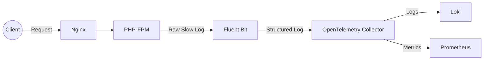
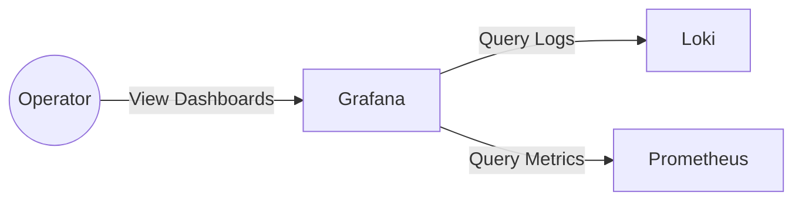

# php-fpm-log-observe-sample

A sample environment to observe PHP-FPM slow logs using **Fluent Bit**, **OpenTelemetry Collector**, and **Grafana LGTM stack** with **Nginx**.

This repository is intended as a companion project for a technical blog about improving observability in PHP-FPM through structured logging and visualization.


## Table of Contents
- [Components](#components)
- [Prerequisites](#prerequisites)
- [Getting Started](#getting-started)
- [Log/Metric Flow](#logmetric-flow)

## Components
- **Nginx**: Serves as a frontend proxy to PHP-FPM.
- **PHP-FPM**: Generates slow logs as raw multi-line text.
- **Fluent Bit**: Collects and parses PHP-FPM logs, merging multi-line stack traces into structured JSON.
- **OpenTelemetry Collector**: Normalizes and exports logs/metrics to the observability backend.
- **Grafana**: Provides visualization for logs and metrics.

## Prerequisites

- Docker & Docker Compose
- Basic knowledge of **PHP-FPM**, **Fluent Bit**, **OpenTelemetry Collector**, and **Grafana**

## Getting Started

Follow these steps to set up the project locally:

### Step 1: Clone the Repository

```bash
git clone https://github.com/ynkt/php-fpm-log-observe-sample
cd php-fpm-log-observe-sample
``` 

### Step 2: Start the Services

```bash
docker-compose up -d
``` 

### Step 3: Access the Dashboard

Once the services are up and running, open the Grafana dashboard:

- **Grafana UI**: http://localhost:3000/dashboards

### Step 4: Explore Logs and Metrics

Access the url that triggers PHP-FPM slow logs:
- **Trigger Slow Logs**:
  - http://localhost:8080/simulate-slow-log_1.php
  - http://localhost:8080/simulate-slow-log_2.php

You can then explore the logs and metrics in Grafana dashboards.

## Log/Metric Flow

1. **PHP-FPM** outputs slow logs (multi-line stack traces included).
2. **Fluent Bit** aggregates lines into a single structured log record using regex parser.
3. **OpenTelemetry Collector** processes and forwards logs to **Loki** and metrics to **Prometheus**.
4. **Grafana** visualizes logs and metrics in dashboards.

To better illustrate the flow, the following diagrams separate the perspectives of service users (Client) and operators (Operator).

1. Client to System Internal Flow



2. Operator Visualization Flow



These diagrams clarify the roles and data flow between the service user and the system operator.